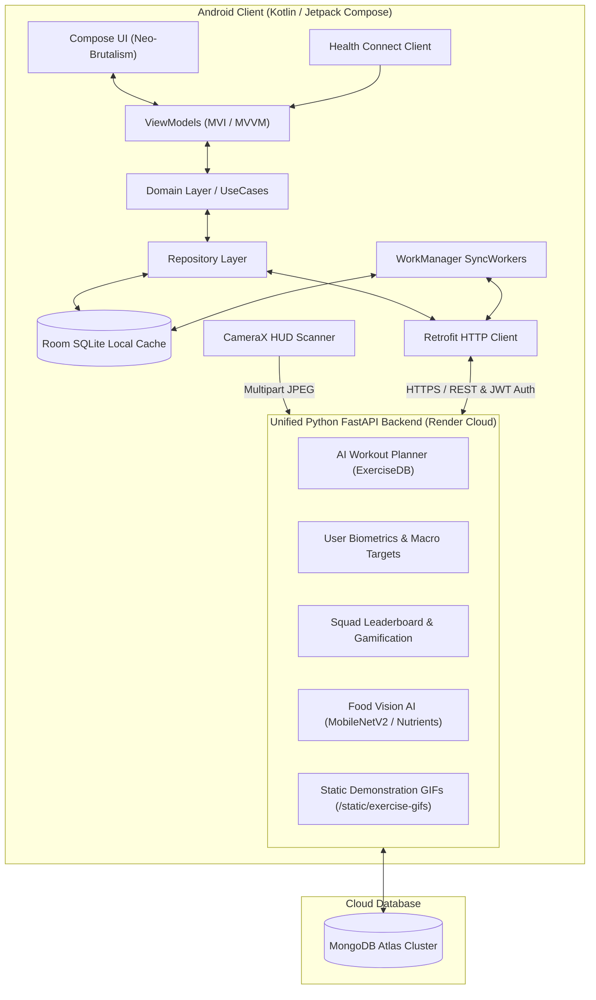

<p align="center">
  
</p>

# ⚡ Pulse - Offline-First AI Fitness, Workout & Nutrition Platform


**Pulse** is a state-of-the-art, full-stack fitness and nutrition platform comprising an **offline-first Android client (Jetpack Compose)** and a **dual-service Python FastAPI backend cluster**. Designed with an aggressive **Neo-Brutalism UI** aesthetic, it delivers personalized AI workout split generation (ExerciseDB integration), real-time camera-based AI food scanning (PyTorch MobileNetV2), Google Health Connect step/sleep tracking, gamified 3D squad leaderboards, and synchronized cloud storage with MongoDB Atlas.

---

## 📑 Table of Contents
1. [System Architecture](#-system-architecture)
2. [Key Platform Capabilities](#-key-platform-capabilities)
3. [Android Client (Pulse App)](#-android-client-pulse-app)
4. [Python Backend Microservices](#-python-backend-microservices)
5. [Complete API Endpoints Reference](#-complete-api-endpoints-reference)
6. [Design System & Aesthetics](#-design-system--aesthetics)
7. [Database Schema & Collections](#-database-schema--collections)
8. [Installation & Setup Guide](#-installation--setup-guide)

---

## 🏗️ System Architecture

Pulse utilizes a modern architecture combining a **Native Kotlin Android Client** with a single **Unified Python FastAPI Backend** and **MongoDB Atlas Cloud**.



---

## ⚡ Key Platform Capabilities

### 1. 🤖 AI Personalized Workout Split Generator (ExerciseDB)
* **Dataset Engine**: Ingests Kaggle ExerciseDB (`exercises.json`, `bodyParts.json`, `equipments.json`, `muscles.json`, and 360x360 animated demonstration GIFs).
* **Smart Algorithm**: Computes custom multi-day splits based on user biometrics (Weight, Height, Age, Gender), fitness goals (*Bulking, Cutting, Strength, Maintenance*), weekly frequency (*2–6 days/week*), time limits (*30–90 mins*), and available equipment (*Barbells, Dumbbells, Cables, Machines, Bodyweight*).
* **Dynamic Programming**: Adjusts sets, rep ranges (*8–12 for Hypertrophy, 4–6 for Strength, 12–15 for Cutting*), rest intervals (*60s–150s*), and estimated session duration.
* **Animated Form Execution**: Serves and renders high-frame-rate demonstration GIFs directly inside each exercise card via Coil GIF decoder.

### 2. 🚀 First-Time Onboarding Routine Builder
* Seamless 4-step wizard for new users (with Google Account auto-prefill):
  * **Step 0**: Name & Biological Gender.
  * **Step 1**: Body Metrics (Weight, Height, Age, Daily Activity Level).
  * **Step 2**: Primary Fitness Objective & Lifting Experience Level.
  * **Step 3**: Weekly Schedule (Days/week), Time Limit, and Equipment Filter.
* Tapping **"Generate & Launch Plan ⚡"** automatically calculates, saves, and adopts the user's weekly split into local SQLite and MongoDB Atlas.

### 3. 📅 Ascending Weekday Focused Training Screen
* **Ascending Weekday Bar**: Clean row showing `Mon` $\rightarrow$ `Sun` with **TODAY** highlighted and badged by default.
* **Focused Daily View**: Eliminates visual clutter by displaying only the active selected day's routine, exercise cards with animated GIFs, sets $\times$ reps, rest timers, and form execution steps.
* **Active Recovery**: Dedicated rest day view with hydration and mobility guidance.
* **Quick Launch**: One-tap **"Start Today's Workout 🚀"** button.

### 4. 🏆 3D Squad Leaderboard & Friend Competition
* **3D Animated Podium**: Gold (1st Place with Crown), Silver (2nd Place), and Bronze (3rd Place) elevated podium blocks. Unfilled spots offer clean **"+ Invite Friend"** triggers.
* **Period Switcher**: Instant switching between **Weekly**, **Monthly**, and **All Time** leaderboards.
* **Detailed Squad Standings**: Ranked player list with avatars, "YOU" badge, steps + workouts activity breakdown, and total points.
* **Personal Weekly Stats**: Spaced-out stat tiles showing Steps, Workouts completed, Squad Points, and Streak counter.

### 5. 📸 AI Real-Time Food Scanner (MobileNetV2)
* Streams camera frames via CameraX on a dedicated background thread (<0.1ms drop rate).
* Fine-tuned PyTorch `MobileNetV2` model predicts food items and retrieves exact macronutrients (`protein_g`, `carbs_g`, `fats_g`, `calories`) from MongoDB.

### 6. 📊 Home Screen Daily Activity & Progress Hub
* **Live Step Progress Bar**: Shows `Today's Steps / 10,000` with completion percentage badge.
* **Metric Pills**: Real-time Distance ($km$), Active Energy Burned ($kcal$), and Walking Time ($mins$).
* **Health Connect Sync**: Automatic background synchronization with Google Health Connect for steps, sleep duration, and active calories.

---

## 📱 Android Client (Pulse App)

### Tech Stack & Libraries
* **Language & Runtime:** Kotlin (Coroutines, Flow, StateFlow)
* **UI Toolkit:** Jetpack Compose with Material 3 & custom Neo-Brutalism tokens.
* **Architecture:** Clean Architecture (`data` $\rightarrow$ `domain` $\rightarrow$ `presentation`) with MVI/MVVM.
* **Dependency Injection:** Dagger Hilt (`@HiltViewModel`, `@AndroidEntryPoint`).
* **Local Persistence (Offline-First):** Room SQLite Database with auto-sync tracking (`isSynced`).
* **Networking:** Retrofit 2 + OkHttp 4 with JWT and `X-API-KEY` security interceptors.
* **Image & Animation Loading:** Coil Compose (`io.coil-kt:coil-compose`) + Coil GIF decoder (`io.coil-kt:coil-gif`).
* **Health Tracking:** Google Health Connect API (`androidx.health.connect.client`).
* **Background Tasks:** AndroidX WorkManager (`SyncWorker`, `LeaderboardSyncWorker`).
* **Authentication:** Google Identity Credential Manager (`androidx.credentials`) + Firebase Auth.

### Screen Directory
| Screen | Route | Key Features |
| :--- | :--- | :--- |
| **Get Started** | `get_started` | Google Sign-In & Guest authentication entry with Pulse logo. |
| **AI Onboarding Wizard** | `onboarding_screen` | 4-step questionnaire for Name/Gender, Biometrics, Goal/Experience, Schedule/Equipment with auto plan generation. |
| **Home (Dashboard)** | `home_screen` | Daily Step Activity Hub (progress bar, distance, burned kcal, active time), 7-day weekly step chart, macro nutrition ring, and next workouts. |
| **Train (Workouts)** | `workout_screen` | Ascending Weekday Bar (`Mon` $\rightarrow$ `Sun`), focused current-day training session, ExerciseDB animated GIF cards, sets, reps, rest timers, and Active Recovery view. |
| **AI Routine Generator** | `plan_generator_screen` | Multi-step interactive routine builder wizard to adjust splits, equipment, and focus muscles. |
| **Meals & Nutrition** | `meal_screen` | Macro nutrient breakdown, daily meals list, and manual food logger. |
| **AI Food Scanner** | `camera_screen` | Live CameraX HUD scanner with real-time PyTorch food classification. |
| **Squad Leaderboard** | `leaderboard_screen` | 3D animated podium (Gold/Silver/Bronze), Weekly/Monthly/All Time tabs, squad code sharing, and ranked standings list. |
| **Profile & Settings** | `profile_screen` | Editable user biometrics, "AI Workout Routine & Schedule" settings launcher, data export (CSV), and account reset. |

---

## 🖥️ Python Backend Microservices

```
Backend_Python/
├── app/
│   ├── main.py                     # FastAPI server, static mount & startup hooks
│   ├── database.py                 # Async Motor MongoDB client & collection handles
│   ├── models/                     # Pydantic schemas (User, Workout, Leaderboard, Meal)
│   ├── routes/
│   │   ├── workout.py              # Plan generation, adoption, and catalog endpoints
│   │   ├── profile.py              # User biometrics & macro calculation
│   │   ├── leaderboard.py          # Squad rankings, points update, and friend codes
│   │   ├── meal.py                 # Meal logging and daily nutrients
│   │   └── auth.py                 # Device authentication
│   └── services/
│       ├── workout_generator.py    # AI Workout Recommendation Algorithm
│       └── dataset_loader.py       # Ingests & seeds ExerciseDB v1 JSON + GIF catalog
├── food-analyser/                  # PyTorch MobileNetV2 food recognition microservice
├── check_db.py                     # CLI script to inspect MongoDB collections
├── test_plan_generator.py          # Unit test for AI split generation algorithm
└── requirements.txt                # Python dependencies
```

---

## 🛠️ Complete API Endpoints Reference

### 1. Workouts & ExerciseDB Engine (`/api/workouts`)
* `POST /api/workouts/generate-plan`: Generates a personalized weekly split based on user biometrics, goal, days/week, session duration, and equipment.
* `POST /api/workouts/adopt-plan`: Saves the generated split into the user's active routine in MongoDB.
* `GET /api/workouts/catalog/exercises`: Query exercises with filters for `muscle`, `equipment`, `bodyPart`, and search query.
* `POST /api/workouts/catalog/seed`: Seeds local ExerciseDB dataset into MongoDB `exercises_catalog`.
* Static Route: `GET /static/exercise-gifs/{filename}.gif`: Serves animated demonstration GIFs.

### 2. User Profile & Biometrics (`/api/profile`)
* `GET /api/profile/{deviceId}`: Fetches user profile, BMR, TDEE, and calculated macro targets.
* `POST /api/profile`: Saves or updates user profile.

### 3. Squad Leaderboards & Gamification (`/api/leaderboard`)
* `GET /api/leaderboard/friends/{userId}?period=weekly|monthly|all_time`: Fetches sorted rankings with points, steps, workouts, and streaks.
* `POST /api/leaderboard/points/update`: Awards points based on daily steps (`steps * 0.05`) and completed workouts (`workouts * 100`).
* `POST /api/leaderboard/friends/add`: Connects two athletes via 6-character squad code.

### 4. AI Food Analyser Microservice (`/scan-food` on Port 8000)
* `POST /scan-food`: Accepts a multipart JPEG image, performs inference via PyTorch MobileNetV2, and returns predicted food class, confidence, and macro nutrient breakdown.

---

## 🎨 Design System & Aesthetics

* **Theme Philosophy:** High-impact, dark-mode **Neo-Brutalism** with solid borders, high contrast, and vivid neon accents.
* **Color Palette:**
  * Background Canvas: `#0E0F12` (Deep Obsidian) / `#121212` (PageBg)
  * Surface Cards: `#1A1D24` (SurfaceDark) / `#222631` (SurfaceAltDark)
  * Primary Accent: `#D4FF00` / `#C6FF00` (Electric LimeGreen)
  * Secondary Accent: `#00E5FF` (Neon Cyan)
  * Alert/Highlights: `#FF6535` (Sunset Amber)
  * Borders: `#2D323F` (StrokeDark)

---

## 📂 Database Schema & Collections

| Collection Name | Document Type | Description |
| :--- | :--- | :--- |
| **`userprofiles`** | `UserProfile` | User biometrics, BMR, TDEE, daily calorie/macro targets, active split, streak counters. |
| **`exercises_catalog`** | `ExerciseCatalog` | ExerciseDB movements with target muscles, body parts, equipment, form steps, and GIF links. |
| **`workouts`** | `Workout` | Logged and adopted training sessions, exercises, sets, reps, weight, and volume. |
| **`meals`** | `Meal` | Logged food entries and macronutrient values. |
| **`nutrients`** | `NutrientReference` | Reference nutritional data per 100g for AI food classifier lookups. |
| **`leaderboard_stats`** | `LeaderboardStat` | Weekly points, streak days, steps count, and workout counts per device. |
| **`friends`** | `FriendLink` | Social graph connections between users via squad codes. |
| **`daily_logs`** | `DailyLog` | Aggregated daily activity history (steps, distance, calories burned). |

---

## 🚀 Installation & Setup Guide

### 1. Prerequisites
* **Python**: 3.10 to 3.13
* **Android Studio**: Ladybug (2024.2+) or newer with JDK 17
* **MongoDB Atlas Cluster**: Free or Dedicated cluster URL

### 2. Python Backend Setup
```bash
# Navigate to backend directory
cd Backend_Python

# Activate virtual environment
..\.venv\Scripts\activate

# Install dependencies
pip install -r requirements.txt

# Start Main API Server (Port 5000)
python -m app.main

# Start AI Food Analyser in separate terminal (Port 8000)
cd food-analyser
python -m app.main

# Inspect database anytime
python check_db.py
```
* Interactive Swagger Docs (Main API): `http://localhost:5000/docs`
* Interactive Swagger Docs (Food Analyser): `http://localhost:8000/docs`

### 3. Android Client Setup
1. Open `GymFitness/` in Android Studio.
2. In `NetworkModule.kt`, verify your PC's local Wi-Fi IP:
   ```kotlin
   const val MAIN_API_URL = "http://192.168.29.171:5000/"
   ```
3. Build and run on a connected Android phone or emulator:
   ```bash
   .\gradlew.bat assembleDebug
   ```
