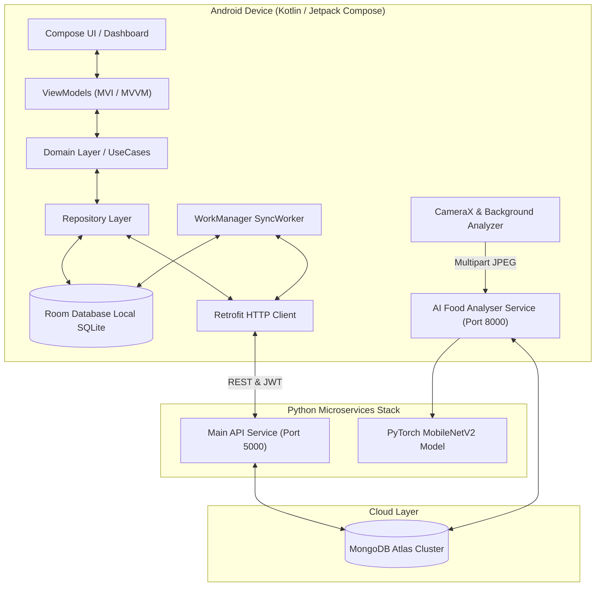

# 🏋️ FitStore - Offline-First Fitness & AI Food Analysis Platform


**FitStore** is a feature-rich, high-performance Android fitness tracking platform paired with a dual-service Python FastAPI backend cluster. Designed around an aggressive **Neo-Brutalism UI** aesthetic, it features real-time AI food recognition, exercise logging, Google Health Connect integration, gamified streaks, and offline-first database synchronization.

---

## 🏗️ System Architecture

FitStore employs a split-tier architecture combining a **Native Kotlin Android Client** with a **RESTful Python FastAPI Server Cluster**.



---

## 🖥️ Backend Microservices Architecture

The Python backend consists of two independent asynchronous services running on separate ports:

### 1. Main API Service (`Port 5000`)
* **Framework & ASGI Server:** FastAPI powered by Uvicorn.
* **Database Driver:** `Motor` (non-blocking async MongoDB Atlas driver).
* **Security & Auth:** Firebase Admin SDK JWT token verification and custom `X-API-KEY` security headers.
* **Endpoints:**
  * `GET/POST /api/auth`: Device authentication and token check-ins.
  * `GET/POST /api/profile`: User biometric stats, fitness goals, daily target macros, and streak counters.
  * `GET/POST /api/workouts`: Exercises, set volume, reps, and weight metrics.
  * `GET/POST /api/meals`: Daily calorie counts and macronutrient breakdowns.
  * `GET /api/leaderboard`: Dynamic weekly friend rankings and active streak multipliers.

### 2. AI Food Analyser Microservice (`Port 8000`)
* **Deep Learning Engine:** Fine-tuned `MobileNetV2` PyTorch model loaded once at server startup for fast (<50ms CPU) inference.
* **Inference Endpoint:** `POST /scan-food`
* **Interactive Documentation:** Live Swagger UI available at `http://localhost:8000/docs`.

---

## 🎨 Design System & Visual Style (Neo-Brutalism)

The UI is built with a bold **Neo-Brutalism** design language characterized by high-contrast color palettes, solid drop shadows, clean typography (*Figtree* & *DM Sans*), and glowing border highlights:

* **Backgrounds:** Sleek Midnight (`#0E0F12`) & Dark Page surfaces (`#16181D`).
* **Accents:** Electric Lime (`#D4FF00`), Cyan Neon (`#00E5FF`), and Sunset Orange (`#FF6535`).
* **Custom Componentry:** `BaseCard`, `PrimaryButton`, `CodeChip`, `NutrientBar`, `CalorieRing`, and neon HUD camera overlays.

---

## 🔄 Core Workflows & Data Synchronization

### 1. AI Food Scanner & Vision Pipeline
1. **Camera Frame Capture:** CameraX streams frames through `ImageAnalysis`.
2. **Off-UI Thread Processing:** Image analysis runs on a dedicated single-threaded `backgroundExecutor`, keeping the Main UI Thread 100% smooth.
3. **Throttling & Early-Drop:** Evaluates `!isAnalyzing && scannedResult == null && (currentTime - lastAnalysisTime >= 2000)`. Discards invalid frames instantly (<0.1ms).
4. **Bitmap Transformation:** Converts YUV frames to rotated JPEG Bitmaps on the background thread.
5. **Inference & Macro Lookup:** Sends `POST /scan-food` to the microservice on port 8000. `MobileNetV2` PyTorch model predicts class label and fetches matching macros (`protein_g`, `carbs_g`, `fats_g`, `calories`) from MongoDB `nutrients` (or offline fallbacks).
6. **Local Storage & Dashboard Propagation:** User confirmation saves the item to Room SQLite (`meals` table). Reactive Kotlin `Flow`s immediately update the Home Screen progress cards and Meals tab.

### 2. Offline-First Background Sync (WorkManager)
* **Local Writes:** Workouts and meal entries are written to Room local tables immediately (`isSynced = false`).
* **Background Sync:** `SyncManager` queues `SyncWorker` tasks via `WorkManager`, constraint-gated to run when connected to the network (`NetworkType.CONNECTED`).
* **Reconciliation:** Successful API sync flags entities as `isSynced = true`.

---

## 📱 Android App Screens Breakdown

| Screen | Route | Working Mechanics |
| :--- | :--- | :--- |
| **Home (Dashboard)** | `home_screen` | Calorie ring loader, step count badge (🔥), Health Connect live step/sleep sync. |
| **Train (Workouts)** | `workout_screen` | Expandable exercise routines, total session volume calculations. |
| **Create Plan** | `create_plan` | Modal bottom sheet builder for custom workout splits. |
| **Workout Detail** | `workout_detail/{workoutId}` | Live interactive workout environment with rep/weight tracking coroutine timer. |
| **Diet (Meals)** | `meal_screen` | CameraX scanner with scanning laser line, food identification popups & manual search. |
| **Rank (Leaderboard)** | `leaderboard_screen` | Podium styling & social rankings calculated from steps (`steps * 0.05`) + workouts (`workouts * 100`). |
| **Social (Squad Code)** | `friend_code` | Letter-by-letter 6-character code reveal, clipboard copy & friend adding. |
| **Profile** | `profile_screen` | Metric configuration fields calculating BMR & TDEE. |

---

## 🔌 AI Food Analyser API Reference

### `POST /scan-food` (Port 8000)

#### Request Headers & Body
* `Content-Type`: `multipart/form-data`
* `file`: JPEG/PNG Image File (Required)
* `X-User-Id`: Android User UID (Optional, default: `anonymous`)

#### Success Response (`200 OK`)
```json
{
  "success": true,
  "food_name": "Egg",
  "calories": 155.0,
  "macros": {
    "protein_g": 13.0,
    "carbs_g": 1.1,
    "fats_g": 11.0,
    "calories": 155.0
  },
  "confidence": 0.9452,
  "logged_at": "2026-07-26T20:30:00+00:00"
}
```

#### Error Codes
* `400 Bad Request`: Invalid image format or empty file upload.
* `404 Not Found`: Food label confidence below threshold (`0.60`).
* `413 Payload Too Large`: Image file exceeds 10 MB limit.
* `500 Internal Server Error`: PyTorch model inference error.

---

## 🛠️ Technology Stack

| Layer | Technology |
|---|---|
| **Android UI** | Jetpack Compose, Material 3, Accompanist Permissions |
| **Architecture** | Clean Architecture (MVI/MVVM), Hilt (DI), Coroutines, StateFlow |
| **Storage & Sync** | Room SQLite DB, WorkManager, Google Health Connect SDK, Glance Widgets |
| **Networking** | Retrofit 2, OkHttp 4 (with JWT & Certificate Pinning) |
| **Backend Services** | Python 3.10+ / 3.13, FastAPI, Uvicorn (ASGI), Pydantic v2 |
| **AI & Computer Vision** | PyTorch, TorchVision, MobileNetV2, PIL, NumPy |
| **Cloud Database** | MongoDB Atlas, Motor (Async Driver) |

---

## ⚙️ Getting Started & Setup Guide

### 1. Backend Setup & Run

```powershell
# Activate Python virtual environment from workspace root
.\.venv\Scripts\Activate.ps1

# Install requirements
pip install -r Backend_Python/requirements.txt
pip install -r Backend_Python/food-analyser/requirements.txt

# Start Main API (Terminal 1)
cd Backend_Python
python -m app.main

# Start AI Food Analyser (Terminal 2)
cd Backend_Python/food-analyser
python run.py
```
* **Main API:** `http://localhost:5000`
* **Food Analyser:** `http://localhost:8000` (Swagger UI: `http://localhost:8000/docs`)

### 2. Android App Configuration

1. Open `GymFitness` in **Android Studio Ladybug** or newer.
2. Ensure JDK 21 is selected in Gradle Settings.
3. Configure `local.properties` in `GymFitness/`:
   ```properties
   API_KEY="your_secret_api_key"
   ```
4. Place your `google-services.json` in `GymFitness/app/`.
5. Update server IP in `NetworkModule.kt`:
   ```kotlin
   private const val MAIN_API_URL = "http://<YOUR_LOCAL_IP>:5000/"
   private const val FOOD_ANALYSER_URL = "http://<YOUR_LOCAL_IP>:8000/"
   ```
6. Build and deploy to an Android device or emulator (API 26+).

---

## 🤖 Fine-Tuning the PyTorch Model

To retrain or update the MobileNetV2 food classifier:

1. Train your custom model on food image datasets (6-class head: *Egg, Chicken, Milk, Broccoli, Avocado, Salmon*).
2. Export state dict: `torch.save(model.state_dict(), "food_mobilenetv2.pth")`.
3. Save custom weights to `Backend_Python/food-analyser/weights/food_mobilenetv2.pth`.
4. Update `class_mapping.json` in the same directory and restart `python run.py`.

---

## 📄 License
MIT License
