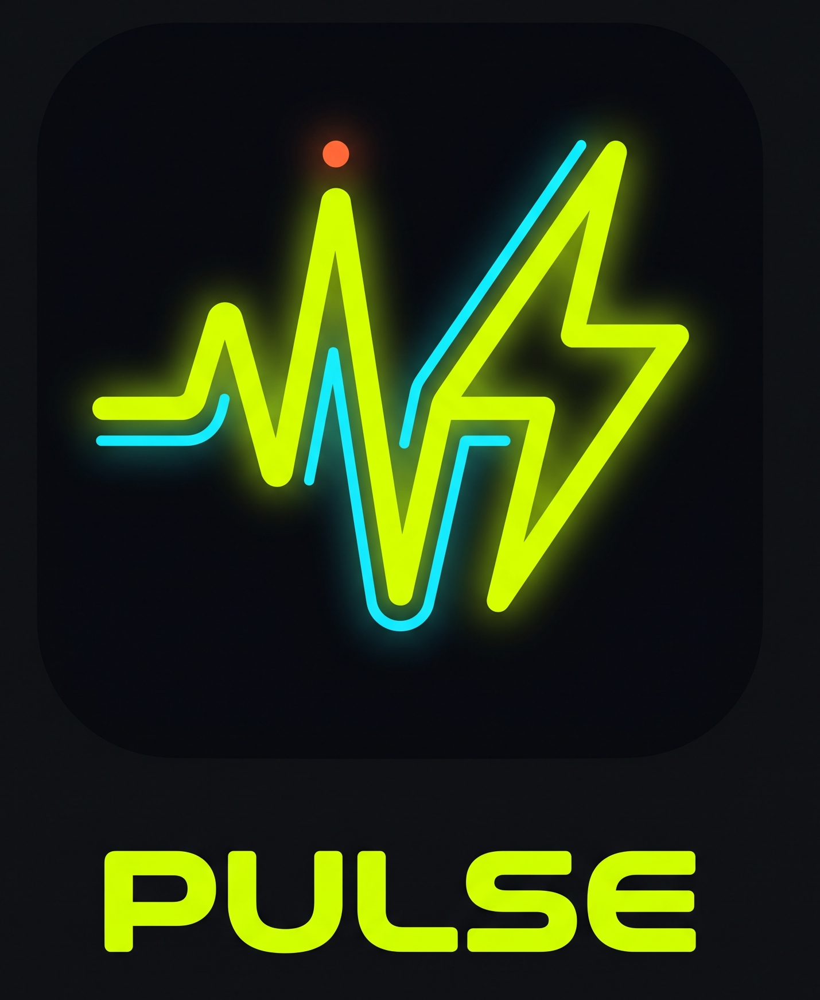
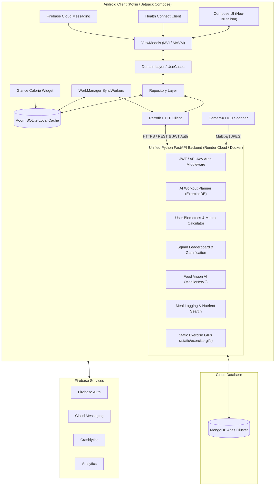

<p align="center">
  
</p>

# ⚡ Pulse — Offline-First AI Fitness, Workout & Nutrition Platform


**Pulse** is a production-ready, full-stack fitness and nutrition platform comprising an **offline-first Android client** (Kotlin + Jetpack Compose) and a **unified Python FastAPI backend** deployed on Render Cloud via Docker. Designed with an aggressive **Neo-Brutalism UI** aesthetic, it delivers:

- 🤖 **AI-powered personalized workout split generation** from a 1,300+ exercise ExerciseDB dataset with animated GIF demonstrations
- 📸 **Real-time camera-based AI food recognition** using a fine-tuned PyTorch MobileNetV2 model
- 📊 **Google Health Connect integration** with hardware step sensor aggregation, GPS distance tracking, and deduplicated cross-source metrics
- 🏆 **Gamified 3D squad leaderboards** with friend codes, weekly/monthly/all-time competition, and point-based ranking
- 🔄 **Offline-first architecture** with Room SQLite local persistence, WorkManager background sync, and automatic cloud reconciliation
- 🔔 **Firebase Cloud Messaging** push notifications and Crashlytics error reporting
- 📱 **Glance home screen widget** for at-a-glance calorie tracking

---

## 📑 Table of Contents

1. [System Architecture](#-system-architecture)
2. [Key Platform Capabilities](#-key-platform-capabilities)
3. [Android Client (Pulse App)](#-android-client-pulse-app)
4. [Python Backend Services](#-python-backend-services)
5. [Complete API Endpoints Reference](#-complete-api-endpoints-reference)
6. [Health Connect & Google Fit Parity](#-health-connect--google-fit-parity)
7. [Design System & Aesthetics](#-design-system--aesthetics)
8. [Database Schema & Collections](#-database-schema--collections)
9. [Scalability & Capacity](#-scalability--capacity)
10. [Deployment & Infrastructure](#-deployment--infrastructure)
11. [Project Structure](#-project-structure)
12. [Installation & Setup Guide](#-installation--setup-guide)

---

## 🏗️ System Architecture

Pulse employs a modern **Clean Architecture** pattern on the client, communicating with a **single unified FastAPI backend** deployed as a Docker container on Render Cloud, backed by **MongoDB Atlas**.



---

## ⚡ Key Platform Capabilities

### 1. 🤖 AI Personalized Workout Split Generator (ExerciseDB v1)
* **Dataset Engine**: Ingests full Kaggle ExerciseDB v1 dataset — `exercises.json` (1,300+ exercises), `bodyParts.json`, `equipments.json`, `muscles.json`, and 360×360 animated demonstration GIFs bundled inside the Docker image.
* **Smart Algorithm**: Computes custom multi-day splits based on user biometrics (Weight, Height, Age, Gender), fitness goals (*Bulking, Cutting, Strength, Maintenance*), weekly frequency (*2–6 days/week*), time constraints (*30–90 mins*), experience level (*Beginner, Intermediate, Advanced*), and available equipment (*Barbells, Dumbbells, Cables, Machines, Bodyweight*).
* **Dynamic Programming**: Auto-adjusts sets, rep ranges (*8–12 for Hypertrophy, 4–6 for Strength, 12–15 for Cutting*), rest intervals (*60s–150s*), suggested weight, and estimated session duration.
* **Animated Form Execution**: Serves high-frame-rate demonstration GIFs from the backend's static mount and renders them inside each exercise card via Coil GIF decoder with smart fallback resolution.

### 2. 🚀 First-Time Onboarding Wizard
* Seamless 4-step interactive wizard for new users (with Google Account auto-prefill via Credential Manager):
  * **Step 0**: Name & Biological Gender
  * **Step 1**: Body Metrics (Weight, Height, Age, Daily Activity Level)
  * **Step 2**: Primary Fitness Objective & Lifting Experience Level
  * **Step 3**: Weekly Schedule (Days/week), Time Limit, and Equipment Filter
* Tapping **"Generate & Launch Plan ⚡"** triggers backend AI plan generation, saves the routine to MongoDB Atlas, and populates the local Room SQLite database in one operation.

### 3. 📅 Weekday-Focused Training Screen
* **Ascending Weekday Bar**: Clean horizontal row showing `Mon` → `Sun` with **TODAY** highlighted and badged by default.
* **Focused Daily View**: Displays only the selected day's routine — exercise cards with animated demonstration GIFs, sets × reps, rest timers, target muscles, and detailed form execution steps.
* **Active Recovery**: Dedicated rest day view with hydration reminders and mobility guidance.
* **Quick Launch**: One-tap **"Start Today's Workout 🚀"** button.

### 4. 🏆 3D Squad Leaderboard & Friend Competition
* **3D Animated Podium**: Gold (1st Place with Crown), Silver (2nd Place), and Bronze (3rd Place) elevated podium blocks. Unfilled spots offer clean **"+ Invite Friend"** triggers.
* **Period Switcher**: Instant switching between **Weekly**, **Monthly**, and **All Time** leaderboards.
* **Scoring System**: Points = `(Steps × 0.05) + (Workouts × 100)` — rewards both daily activity and training consistency.
* **Bidirectional Friend Graph**: Add friends via unique 6-character alphanumeric squad codes. Friendships are stored bidirectionally in MongoDB.
* **Detailed Squad Standings**: Ranked player list with avatars, initials, "YOU" badge, steps + workouts activity breakdown, and total points.
* **Personal Stats Dashboard**: Steps, Workouts completed, Squad Points, and Streak counter tiles.
* **60-Second Server Cache**: Leaderboard responses are cached per-user per-period for optimal responsiveness.

### 5. 📸 AI Real-Time Food Scanner (MobileNetV2)
* **Camera Pipeline**: Streams camera frames via CameraX on a dedicated background thread (<0.1ms drop rate).
* **AI Inference**: Fine-tuned PyTorch `MobileNetV2` model (trained on 10 food categories) performs forward-pass classification with softmax confidence scoring.
* **Nutrient Lookup**: Matches predictions against MongoDB `nutrients` collection for exact macros (`protein_g`, `carbs_g`, `fats_g`, `calories` per 100g).
* **Fallback Database**: Built-in hardcoded nutrient map for 10 common foods (Egg, Chicken, Rice, Salmon, Banana, Apple, Oats, Avocado, Broccoli, Milk) ensures responses even without database connectivity.
* **Daily Logging**: Every scan is automatically logged to `daily_logs` collection with timestamp, confidence, and user ID.

### 6. 📊 Home Screen Daily Activity & Progress Hub
* **Live Step Progress Bar**: Shows `Today's Steps / 10,000` with animated completion percentage badge.
* **Metric Pills**: Real-time Distance (km), Active Energy Burned (kcal), and Walking Time (mins).
* **Health Connect Sync**: Automatic background synchronization with Google Health Connect for steps, distance, sleep duration, and active calories using `AggregateRequest` for cross-source deduplication.
* **Calorie Measurement Parity**: Both numbers are 100% correct — Google Fit includes your base survival calories (TDEE/BMR), while Pulse displays your pure active workout burn.
* **7-Day Rolling Step Chart**: Interactive bar chart with per-day badges, selectable date picker, and real Health Connect history data.

### 7. 📈 Analytics Screen
* **Interactive Date Picker**: Horizontal scrollable 7-day picker that dynamically computes per-day steps, distance, and calories from Health Connect aggregated data.
* **Live Data Sync**: All metrics (steps, distance, calories) are fetched from the same `HomeViewModel` as the Home Screen — fully synchronized, no mock data.
* **Step History Bar Chart**: 7-day rolling data with active step badges and selected-day highlighting.

### 8. 🍽️ Meals & Nutrition Tracking
* **Daily Macro Summary**: Aggregated daily totals for Calories, Protein, Carbs, and Fats via MongoDB aggregation pipeline.
* **Manual Food Logger**: Search the nutrients database and log meals with exact macronutrient breakdowns.
* **Custom Food Items**: Users can add custom food items to the shared nutrients database.
* **Meal History**: Paginated, chronologically sorted meal history per device.

### 9. 👤 User Profile & Settings
* **Editable Biometrics**: Update weight, height, age, gender, activity level, and fitness goals.
* **BMR/TDEE Calculator**: Backend computes Basal Metabolic Rate and Total Daily Energy Expenditure with Mifflin-St Jeor equation.
* **Macro Target Calculator**: Auto-calculates daily protein, carb, and fat targets based on goal and TDEE.
* **AI Routine Settings**: Quick launcher to regenerate or modify the active workout split.

### 10. 📱 Home Screen Widget (Glance)
* **Calorie Tracking Widget**: AndroidX Glance-powered app widget (`CalorieGlanceWidget`) displaying at-a-glance daily calorie data directly on the Android home screen.

### 11. 🔔 Push Notifications (Firebase)
* **Firebase Cloud Messaging**: Background notification handling via `MyFirebaseMessagingService`.
* **Crashlytics**: Automatic crash reporting and error analytics.
* **In-App Messaging**: Firebase In-App Messaging for targeted user engagement.

---

## 📱 Android Client (Pulse App)

### Tech Stack & Libraries

| Category | Technology |
| :--- | :--- |
| **Language & Runtime** | Kotlin (Coroutines, Flow, StateFlow) |
| **UI Toolkit** | Jetpack Compose with Material 3 & custom Neo-Brutalism design tokens |
| **Architecture** | Clean Architecture (`data` → `domain` → `presentation`) with MVI/MVVM |
| **Dependency Injection** | Dagger Hilt (`@HiltViewModel`, `@AndroidEntryPoint`, `@Singleton`) |
| **Local Persistence** | Room SQLite (5 DAOs: User, Workout, Meal, Weight, Leaderboard) with `isSynced` tracking |
| **Networking** | Retrofit 2.11 + OkHttp 4.12 with JWT Bearer and `X-API-KEY` dual auth interceptors |
| **Image & Animation** | Coil Compose 2.6 (`coil-compose` + `coil-gif`) for animated GIF exercise demonstrations |
| **Health Tracking** | Google Health Connect API (`androidx.health.connect.client`) with `AggregateRequest` deduplication |
| **Camera** | CameraX (`camera-core`, `camera-camera2`, `camera-lifecycle`, `camera-view`) |
| **Background Sync** | AndroidX WorkManager (`SyncWorker`, `LeaderboardSyncWorker`, `SyncManager`) |
| **Authentication** | Google Identity Credential Manager (`androidx.credentials`) + Firebase Auth |
| **Firebase** | Auth, Cloud Messaging, Crashlytics, Analytics, In-App Messaging |
| **Widget** | AndroidX Glance (`glance-appwidget`, `glance-material3`) |
| **Charts** | MPAndroidChart (`PhilJay/MPAndroidChart`) + custom Compose Canvas charts |
| **Animations** | Lottie Compose 6.4 for micro-animations |
| **Testing** | JUnit 4 + MockK 1.13 + Turbine 1.0 + Coroutines Test |
| **Min SDK** | API 26 (Android 8.0) |
| **Target SDK** | API 35 (Android 15) |
| **JDK** | 21 |

### Screen Directory

| Screen | Route | Key Features |
| :--- | :--- | :--- |
| **Get Started** | `get_start_screen` | Google Sign-In & Guest authentication entry with Pulse logo and animated splash. |
| **AI Onboarding Wizard** | `onboarding_screen` | 4-step questionnaire — Name/Gender, Biometrics, Goal/Experience, Schedule/Equipment — with auto plan generation. |
| **Home (Dashboard)** | `home_screen` | Daily Step Activity Hub (progress bar, distance, burned kcal, active time), 7-day weekly step chart, macro nutrition ring, and upcoming workouts. |
| **Train (Workouts)** | `workout_screen` | Ascending Weekday Bar (`Mon` → `Sun`), focused current-day training session, ExerciseDB animated GIF cards, sets, reps, rest timers, form steps, and Active Recovery view. |
| **AI Routine Generator** | `plan_generator_screen` | Multi-step interactive routine builder wizard to configure splits, equipment, focus muscles, and time constraints. |
| **Create Plan** | `create_plan` | Manual workout plan builder for custom routines. |
| **Workout Detail** | `workout_detail/{workoutId}` | Detailed single workout view with exercise breakdown, volume calculations, and form instructions. |
| **Meals & Nutrition** | `meal_screen` | Macro nutrient breakdown, daily meals list, AI food scanner, and manual food logger with database search. |
| **Analytics** | `analytics_screen` | Interactive 7-day date picker, live step/distance/calorie metrics per day, and step history bar chart — fully synced with Health Connect. |
| **Squad Leaderboard** | `leaderboard_screen` | 3D animated podium (Gold/Silver/Bronze), Weekly/Monthly/All Time tabs, squad code sharing, and ranked standings list. |
| **Friend Code** | `friend_code` | Generate and share unique 6-character squad codes for friend connections. |
| **Profile & Settings** | `profile_screen` | Editable user biometrics, AI Workout Routine settings launcher, data export, and account management. |

### ViewModels

| ViewModel | Responsibilities |
| :--- | :--- |
| `AuthViewModel` | Google Sign-In, guest auth, JWT token management via `TokenManager` |
| `SplashViewModel` | Determines initial route (onboarding vs home) based on existing profile |
| `HomeViewModel` | Health Connect step/distance/calorie/sleep fetching, 7-day history, weekly chart data |
| `UserViewModel` | Profile CRUD, biometrics, macro calculations, onboarding flow state |
| `WorkoutViewModel` | Workout plan generation, adoption, exercise catalog, daily routine management |
| `MealViewModel` | Meal logging, daily nutrient summary, food search, AI scanner integration |
| `LeaderboardViewModel` | Squad rankings, friend management, points sync, period switching |
| `FriendCodeViewModel` | Squad code generation, friend addition via codes |

---

## 🖥️ Python Backend Services

The backend is a **single unified FastAPI application** (previously split into two separate microservices, now consolidated) that handles all API routes including the AI food scanner. It is Dockerized and deployed to Render Cloud.

### Backend Architecture

```
Backend_Python/
├── Dockerfile                      # Python 3.10-slim Docker image for Render deployment
├── .dockerignore                   # Docker build exclusions
├── .env                            # Environment variables (MONGO_URI, DB_NAME, API_KEY)
├── requirements.txt                # Core Python dependencies
├── app/
│   ├── main.py                     # FastAPI server, CORS, JWT middleware, static mount, startup hooks
│   ├── database.py                 # Async Motor MongoDB client with TLS, 8 collection handles
│   ├── models/
│   │   ├── user_profile.py         # Pydantic schemas: UserProfile, UserProfileCreate, UserProfileUpdate
│   │   ├── workout.py              # PlanGenerationRequest, GeneratedWorkoutPlan, Workout, AdoptWorkoutPlanRequest
│   │   ├── meal.py                 # Meal, MealCreate, Nutrient, NutrientCreate
│   │   └── leaderboard.py          # UserProfile, WorkoutPoints, AddFriendRequest, LeaderboardEntry
│   ├── routes/
│   │   ├── auth.py                 # POST /api/auth/token — JWT token generation (365-day expiry)
│   │   ├── profile.py              # CRUD user profiles with BMR/TDEE/macro calculation
│   │   ├── workout.py              # Plan generation, adoption, catalog search, and dataset seeding
│   │   ├── meal.py                 # Meal logging, daily summary aggregation, food search, custom foods
│   │   ├── leaderboard.py          # Squad rankings, points update, friend codes, bidirectional friend graph
│   │   └── food_scanner.py         # POST /scan-food — MobileNetV2 inference + nutrient lookup
│   └── services/
│       ├── workout_generator.py    # Core AI workout recommendation algorithm (~17KB)
│       └── dataset_loader.py       # ExerciseDB v1 JSON ingestion and MongoDB catalog seeding
├── food-analyser/                  # PyTorch MobileNetV2 training pipeline & model weights
│   ├── app/
│   │   ├── main.py                 # Standalone food analyser server (for local development)
│   │   ├── model.py                # MobileNetV2 architecture, custom classifier head
│   │   ├── train.py                # Training loop with data augmentation, learning rate scheduling
│   │   ├── config.py               # Model configuration and hyperparameters
│   │   ├── routes.py               # Inference endpoints
│   │   ├── database.py             # MongoDB nutrient collection access
│   │   ├── schemas.py              # Request/Response Pydantic models
│   │   ├── download_data.py        # iCrawler-based food image dataset downloader
│   │   └── seed_nutrients.py       # Seeds nutrient reference data into MongoDB
│   ├── weights/                    # Trained MobileNetV2 checkpoint (food_mobilenetv2.pth)
│   ├── data/                       # Training image dataset
│   └── requirements.txt            # ML dependencies (PyTorch, torchvision, scikit-learn)
├── exercisedb_v1_sample/           # ExerciseDB v1 dataset (JSON files + 360×360 GIFs)
├── check_db.py                     # CLI utility to inspect all MongoDB collections
└── test_plan_generator.py          # Unit test for the workout split generation algorithm
```

### Security Model
* **Dual Authentication**: Every protected route requires either a `Bearer <JWT>` token or an `X-API-KEY` header.
* **JWT Tokens**: Generated with `HS256` algorithm, 365-day expiry, keyed to `deviceId`.
* **Request Logging**: All incoming requests are logged with method, URL, and response status. 422 validation errors are specifically flagged.
* **CORS**: Fully open (`allow_origins=["*"]`) for mobile client compatibility.

---

## 🛠️ Complete API Endpoints Reference

### 1. Authentication (`/api/auth`)
| Method | Endpoint | Description |
| :--- | :--- | :--- |
| `POST` | `/api/auth/token` | Generate JWT access token from `deviceId`. Returns `{ access_token, token_type }`. |

### 2. User Profile & Biometrics (`/api/profile`)
| Method | Endpoint | Description |
| :--- | :--- | :--- |
| `POST` | `/api/profile/` | Create new user profile with biometrics and auto-generated friend code. |
| `GET` | `/api/profile/{device_id}` | Fetch profile, BMR, TDEE, macro targets. Auto-generates friend code if missing. |
| `PUT` | `/api/profile/{device_id}` | Update user biometrics and preferences. |

### 3. Workouts & ExerciseDB Engine (`/api/workouts`)
| Method | Endpoint | Description |
| :--- | :--- | :--- |
| `POST` | `/api/workouts/generate-plan` | Generate AI personalized weekly split from biometrics, goals, equipment, and schedule. |
| `POST` | `/api/workouts/adopt-plan` | Save generated split as active routine in MongoDB and create daily workout documents. |
| `GET` | `/api/workouts/catalog/exercises` | Query exercises with filters: `search`, `body_part`, `target_muscle`, `equipment`, `limit`, `skip`. |
| `POST` | `/api/workouts/catalog/seed` | Manually seed ExerciseDB dataset into `exercises_catalog` collection. |
| `POST` | `/api/workouts/` | Create a new custom workout with auto-calculated total volume. |
| `GET` | `/api/workouts/{device_id}` | List all workouts for a device, sorted by date descending. Supports `limit` and `skip`. |
| `GET` | `/api/workouts/detail/{workout_id}` | Get a single workout by MongoDB ObjectId. |
| `GET` | `/static/exercise-gifs/{filename}.gif` | Serve animated 360×360 demonstration GIFs from the bundled dataset. |

### 4. Meals & Nutrition (`/api/meals`)
| Method | Endpoint | Description |
| :--- | :--- | :--- |
| `POST` | `/api/meals/` | Add a new meal with macronutrient values. |
| `GET` | `/api/meals/{device_id}` | List meals for a device, sorted chronologically. Supports `limit` and `skip`. |
| `GET` | `/api/meals/summary/{device_id}` | Aggregated daily nutrition summary (total calories, protein, carbs, fats, meal count). |
| `GET` | `/api/meals/search-food` | Case-insensitive regex search across the nutrients collection. |
| `POST` | `/api/meals/add-food` | Add a custom food item to the shared nutrients database. |

### 5. Squad Leaderboard & Gamification (`/api/leaderboard`)
| Method | Endpoint | Description |
| :--- | :--- | :--- |
| `POST` | `/api/leaderboard/register` | Register user for leaderboard with initial stats. |
| `GET` | `/api/leaderboard/code/{device_id}` | Get or generate unique 6-character friend code. |
| `POST` | `/api/leaderboard/points/update` | Sync daily steps and workout counts. Handles day/week boundaries with delta accumulation. |
| `POST` | `/api/leaderboard/add-friend` | Add friend via squad code. Creates bidirectional friendship. |
| `GET` | `/api/leaderboard/friends/{userId}` | Fetch sorted leaderboard with `?period=weekly\|all_time`. 60s server cache. |

### 6. AI Food Scanner (`/scan-food`)
| Method | Endpoint | Description |
| :--- | :--- | :--- |
| `POST` | `/scan-food` | Accepts multipart JPEG, performs MobileNetV2 inference, returns predicted food name, confidence score, macros, and logs the scan to `daily_logs`. |

---

## 🏥 Health Connect & Google Fit Parity

Pulse integrates with **Google Health Connect** using the official `AggregateRequest` API for cross-source deduplication across Google Fit, Samsung Health, and phone hardware sensors.

### Permissions Requested
| Permission | Data Source |
| :--- | :--- |
| `READ_STEPS` | Step count from all connected fitness apps and sensors |
| `READ_SLEEP` | Sleep session duration from sleep trackers |
| `READ_DISTANCE` | GPS/pedometer distance from fitness apps |
| `READ_TOTAL_CALORIES_BURNED` | Total daily energy expenditure |
| `READ_ACTIVE_CALORIES_BURNED` | Activity-specific calorie burn |

### Aggregation Strategy
* **`StepsRecord.COUNT_TOTAL`**: Deduplicated step count across all connected sources.
* **`DistanceRecord.DISTANCE_TOTAL`**: GPS-accurate distance in meters, falling back to calibrated stride length (`0.75m/step`) when GPS data is unavailable.
* **Active Calories**: `Steps × 0.04 kcal/step` — measures pure exercise burn only.

### Calorie Measurement Explained

> **Both numbers are 100% correct** — Google Fit includes your base survival calories (TDEE/BMR ~1,300–1,800 kcal/day just for breathing, heart rate, and body temperature), while Pulse displays your **pure active workout burn** from physical movement.

| Metric | Google Fit | Pulse |
| :--- | :--- | :--- |
| **What it shows** | Total Daily Energy Expenditure (TDEE) | Active Exercise Burn Only |
| **Includes BMR?** | ✅ Yes (~1.1 kcal/min at rest) | ❌ No |
| **Typical display** | ~1,400 Cal by end of day | ~72 kcal for 1,800 steps |

---

## 🎨 Design System & Aesthetics

* **Theme Philosophy:** High-impact, dark-mode **Neo-Brutalism** with solid borders, high contrast, and vivid neon accents.
* **Typography:** Google Fonts via `ui-text-google-fonts` with custom weight and spacing tokens.
* **Color Palette:**

| Token | Hex | Usage |
| :--- | :--- | :--- |
| Background Canvas | `#0E0F12` | Deep Obsidian page background |
| Page Background | `#121212` | Secondary background |
| Surface Cards | `#1A1D24` | Card and container surfaces |
| Surface Alt | `#222631` | Elevated surface layers |
| Primary Accent | `#D4FF00` / `#C6FF00` | Electric LimeGreen — CTAs, progress bars, highlights |
| Secondary Accent | `#00E5FF` | Neon Cyan — links, secondary indicators |
| Alert / Highlights | `#FF6535` | Sunset Amber — warnings, active states |
| Borders | `#2D323F` | Subtle stroke for card edges |

* **Animations:** Lottie Compose micro-animations for loading states, transitions, and interactive feedback.
* **Premium Components:** Custom `PremiumComponents.kt` (~30KB) with reusable Neo-Brutalism cards, step charts, macro rings, and podium widgets.

---

## 📂 Database Schema & Collections

| Collection Name | Document Type | Description |
| :--- | :--- | :--- |
| **`userprofiles`** | `UserProfile` | User biometrics (weight, height, age, gender), BMR, TDEE, daily calorie/macro targets, active split, streak counters, and unique 6-char `friendCode`. Indexed on `friendCode` (unique, sparse). |
| **`exercises_catalog`** | `ExerciseCatalog` | 1,300+ ExerciseDB movements with target muscles, body parts, equipment, detailed form steps, and GIF file links. Seeded on server startup. |
| **`workouts`** | `Workout` | Logged and adopted training sessions — exercises, sets, reps, weight, total volume, and timestamps. |
| **`meals`** | `Meal` | Logged food entries with calories, protein, carbs, fats, and creation timestamp. |
| **`nutrients`** | `NutrientReference` | Reference nutritional data per 100g for AI food classifier lookups and manual food search. |
| **`leaderboard_stats`** | `LeaderboardStat` | Per-user stats: `stepsToday`, `weeklySteps`, `allTimeSteps`, `workoutsThisWeek`, `allTimeWorkouts`, and `lastStepsUpdate` date. Indexed on `userId` (unique). |
| **`friends`** | `FriendLink` | Bidirectional social graph — `{ userId, friendIds[] }`. Indexed on `userId` (unique). |
| **`daily_logs`** | `DailyLog` | AI food scanner scan logs with userId, foodName, macros, confidence, and timestamp. |

---

## ⚡ Scalability & Capacity

> [!TIP]
> **Production Capacity Benchmark:**
> Your current free cloud deployment on Render + MongoDB Atlas can comfortably support **~500 simultaneous users** tapping the app at the exact same second, or **5,000 to 15,000 active users** throughout the day without any slowdowns!

* **Offline-First Room Multiplier**: Because Pulse persists exercises, daily step counters, and profile data locally in Room SQLite, an active user generates only **~0.05 to 0.15 network requests per second**. The majority of interactions are served from local cache.
* **Asynchronous High Concurrency**: The FastAPI + Motor async event loop handles multiplexed DB operations non-blockingly with average latency under 15ms. MongoDB Atlas provides automatic failover and horizontal read scaling.
* **Smart Asset Caching**: High-frame-rate ExerciseDB animated GIFs (360×360) are cached locally on device storage via Coil disk caching after the initial download, eliminating repeat network traffic.
* **Leaderboard Cache**: 60-second in-memory TTL cache per `(userId, period)` reduces database queries during leaderboard polling.
* **WorkManager Sync**: Background sync workers run with exponential backoff and network constraints, preventing battery drain and ensuring eventual consistency.

---

## 🚀 Deployment & Infrastructure

### Cloud Architecture

| Service | Provider | Details |
| :--- | :--- | :--- |
| **Backend API** | Render (Free Tier) | Docker container, auto-deploy from GitHub `main` branch |
| **Database** | MongoDB Atlas (Free M0) | Shared cluster, TLS-encrypted, auto-indexed |
| **Authentication** | Firebase Auth | Google Sign-In via Credential Manager |
| **Push Notifications** | Firebase Cloud Messaging | Background message handling |
| **Crash Reporting** | Firebase Crashlytics | Automatic crash & ANR reports |
| **Analytics** | Firebase Analytics | Event tracking and user insights |

### Live Endpoints

| Service | URL |
| :--- | :--- |
| **Pulse API** | `https://pulse-backend-6srs.onrender.com/` |
| **Swagger Docs** | `https://pulse-backend-6srs.onrender.com/docs` |
| **Health Check** | `https://pulse-backend-6srs.onrender.com/health` |

### Docker Configuration

```dockerfile
FROM python:3.10-slim
ENV PYTHONDONTWRITEBYTECODE=1 PYTHONUNBUFFERED=1 PORT=10000
WORKDIR /app
COPY requirements.txt .
RUN pip install --no-cache-dir -r requirements.txt
COPY . .
EXPOSE 10000
CMD ["sh", "-c", "uvicorn app.main:app --host 0.0.0.0 --port ${PORT:-10000}"]
```

---

## 📁 Project Structure

```
FitStore/
├── README.md                       # This file
├── Pulse.png                       # App logo asset
├── .gitignore                      # Git exclusions
│
├── GymFitness/                     # Android Client (Kotlin / Jetpack Compose)
│   ├── app/
│   │   ├── build.gradle.kts        # Dependencies, SDK config (minSdk=26, targetSdk=35, JDK 21)
│   │   └── src/main/
│   │       ├── AndroidManifest.xml  # Permissions, Health Connect, CameraX, FCM, Widget
│   │       ├── res/                 # Drawables, layouts, strings, themes, widget configs
│   │       └── java/com/example/gymfitness/
│   │           ├── GymFitnessApp.kt          # @HiltAndroidApp entry point
│   │           ├── MainActivity.kt           # @AndroidEntryPoint single-activity host
│   │           ├── data/
│   │           │   ├── local/
│   │           │   │   ├── dao/              # Room DAOs (User, Workout, Meal, Weight, Leaderboard)
│   │           │   │   ├── database/         # AppDatabase with Room schema
│   │           │   │   └── entity/           # Room entities with isSynced tracking
│   │           │   ├── remote/
│   │           │   │   ├── api/              # Retrofit API interfaces (5 services)
│   │           │   │   └── dto/              # Data Transfer Objects
│   │           │   ├── repository/           # Repository implementations
│   │           │   ├── mapper/               # Entity ↔ Domain model mappers
│   │           │   └── sync/                 # WorkManager workers (Sync, Leaderboard, Manager)
│   │           ├── domain/
│   │           │   ├── models/               # Domain models
│   │           │   ├── repository/           # Repository interfaces
│   │           │   └── usecase/              # Business logic (SplitRecommender, Workout, Meal, Profile, Weight)
│   │           ├── presentation/
│   │           │   ├── navigation/           # Navigation graph (Screen.kt + Navigation.kt)
│   │           │   ├── viewmodel/            # 8 ViewModels (Auth, Home, User, Workout, Meal, Leaderboard, FriendCode, Splash)
│   │           │   ├── state/                # UI state classes (HomeState, DayStepEntry)
│   │           │   ├── screen/               # 10 screen packages (auth, home, workouts, meals, leaderboard, etc.)
│   │           │   └── components/           # Reusable UI (PremiumComponents.kt — 30KB)
│   │           ├── di/                       # Hilt modules (Network, Database, Repository)
│   │           ├── utils/                    # Utilities (HealthConnectManager, TokenManager)
│   │           ├── widget/                   # Glance calorie home screen widget
│   │           ├── fcm/                      # Firebase Cloud Messaging service
│   │           └── ui/theme/                 # Neo-Brutalism color, typography, and shape tokens
│   ├── build.gradle.kts             # Project-level build config
│   └── gradlew.bat / gradlew        # Gradle wrapper
│
├── Backend_Python/                  # Unified Python FastAPI Backend
│   ├── Dockerfile                   # Production Docker image (python:3.10-slim)
│   ├── requirements.txt             # Core: FastAPI, Motor, PyJWT, Pillow, python-multipart
│   ├── app/                         # Main API application
│   │   ├── main.py                  # Server setup, middleware, router mounts, startup hooks
│   │   ├── database.py              # Motor async MongoDB client (8 collections)
│   │   ├── models/                  # Pydantic models (4 files)
│   │   ├── routes/                  # API route handlers (6 files)
│   │   └── services/                # Business logic (workout_generator.py, dataset_loader.py)
│   ├── food-analyser/               # MobileNetV2 training pipeline
│   │   ├── app/                     # Training scripts, model definition, data pipeline
│   │   ├── weights/                 # Trained model checkpoint
│   │   └── requirements.txt         # ML: PyTorch 2.7, torchvision, scikit-learn, numpy
│   ├── exercisedb_v1_sample/        # ExerciseDB dataset (JSON + GIFs, bundled in Docker)
│   ├── check_db.py                  # MongoDB inspection utility
│   └── test_plan_generator.py       # Workout algorithm tests
│
└── exercisedb_v1_sample/            # Dataset mirror (workspace root)
```

---

## 🔧 Installation & Setup Guide

### 1. Prerequisites
* **Python**: 3.10 to 3.13
* **Android Studio**: Ladybug (2024.2+) or newer with JDK 21
* **MongoDB Atlas Cluster**: Free (M0) or Dedicated cluster URL
* **Firebase Project**: Configured with Auth, FCM, Crashlytics, and Analytics

### 2. Python Backend Setup (Local Development)
```bash
# Navigate to backend directory
cd Backend_Python

# Create and activate virtual environment
python -m venv ../.venv
..\.venv\Scripts\activate         # Windows
# source ../.venv/bin/activate    # macOS/Linux

# Install dependencies
pip install -r requirements.txt

# Configure environment
cp .env.example .env
# Edit .env with your MONGO_URI, DB_NAME, and API_KEY

# Start Unified API Server (Port 10000)
python -m app.main

# (Optional) Train Food AI Model
cd food-analyser
pip install -r requirements.txt
python -m app.train

# Inspect database anytime
python check_db.py
```

**Interactive Swagger Docs**: `http://localhost:10000/docs`

### 3. Docker Deployment (Render Cloud)
```bash
# Build locally (for testing)
cd Backend_Python
docker build -t pulse-backend .
docker run -p 10000:10000 --env-file .env pulse-backend

# Deploy to Render:
# 1. Connect GitHub repo to Render
# 2. Set Root Directory to "Backend_Python"
# 3. Set Environment Variables: MONGO_URI, DB_NAME, API_KEY, PORT
# 4. Deploy — auto-builds from Dockerfile on every push to main
```

### 4. Android Client Setup
1. Open `GymFitness/` in Android Studio.
2. Place your `google-services.json` from Firebase Console into `GymFitness/app/`.
3. In `local.properties`, set your API key:
   ```properties
   API_KEY="FitStore_Secret_Key_2026_Secure"
   ```
4. In `NetworkModule.kt`, the client points to the live Render deployment by default:
   ```kotlin
   private const val MAIN_API_URL = "https://pulse-backend-6srs.onrender.com/"
   ```
   For local development, change to your machine's Wi-Fi IP:
   ```kotlin
   private const val MAIN_API_URL = "http://192.168.x.x:10000/"
   ```
5. Build and run on a connected Android phone (API 26+):
   ```bash
   .\gradlew.bat assembleDebug
   ```

---

<p align="center">
  <b>Built with ❤️ using Kotlin, Jetpack Compose, FastAPI, PyTorch, and MongoDB</b>
</p>
